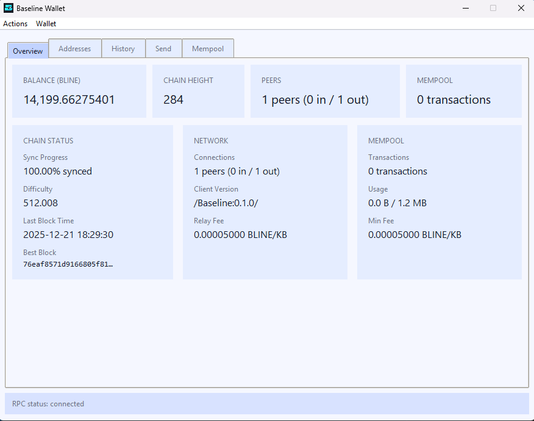

# Baseline



Baseline is a minimalist Bitcoin-style payments chain — but it ships with the stuff operators actually need built-in: fast blocks, Core-ish RPC, a native address index, and a turnkey pool server. No smart contracts, no token zoo, no bloat.

- **Turnkey mining + pool ops**: built-in Stratum v1 server (vardiff, sessions) + automatic payout tracking/ledger + payout tx builder (run a community pool without extra daemons).
- **Scheduled Send capability**: Reserve future payments with cancelable and non-cancelable options - just like scheduling a transaction on traditional finance platforms.
- **Explorer-ready out of the box**: native address index (UTXOs + tx history) exposed via RPC (getaddressutxos, getaddressbalance, getaddresstxids) — no external indexer needed.
- **Fast confirmations, stable cadence**: 20s blocks + per-block LWMA difficulty retarget designed to stay responsive without wild oscillation.
- **Predictable emission (no drama)**: Bitcoin-style JSON-RPC surface for easier exchange/wallet/explorer integration, plus a built-in status panel.
- **Minimal by design**: Python 3.12+, stdlib only, compact codebase, formal spec, strict linting + tests.

## Network Parameters

- **Consensus**: SHA256d proof-of-work, 32-byte block hashes, PoW limit 0x207fffff (used for genesis and height 1), then difficulty adjusts per-block via LWMA.
- **Timing**: 20-second block target, per-block LWMA difficulty retarget using a 60-block window to stay responsive without oscillations.
- **Difficulty** is the target hash threshold miners must beat; lower targets = harder work. Baseline encodes this exactly like Bitcoin in the header `bits` field.
Every block, the node recomputes a new target from recent block times using a linearly weighted moving average (LWMA). If blocks arrive too fast, the target tightens; too slow and it loosens.
- **Premine**: No premine. Mainnet genesis coinbase pays **0** (verified via hardcoded genesis).
- **Dev fund**: **1%** of the block *subsidy* (not fees) is paid in the coinbase to the consensus-critical foundation address.
- **Rewards**: 50 BLINE base subsidy decays smoothly every block using an exponential curve with a 4,158,884-block half-life (~2.64 years). Transaction fees are added to the subsidy.
- **Coinbase maturity**: 20 blocks before mined funds can be spent.
- **Fees**: Minimum relay fee is 5,000 liners per kB; non-standard scripts are rejected, so typical P2PKH transactions should pay at least ~0.0000125 BLINE for a 250-byte tx.
- **Ports**: P2P `9333`, RPC `8832`, Stratum `3333`.

### Supply Schedule


Subsidy decays exponentially each block with a 4,158,884-block half-life (~2.64 years), so rewards glide downward and asymptotically cap supply at ~300 million BLINE without cliff events.

## Quick Start

### 1. Install Python environment

Baseline targets **Python 3.12 or newer** (3.12/3.13 verified). Confirm Python is available before continuing:

```bash
python --version || py -3 --version
```

If the first command fails on Windows, try `py -3`. Once you have a compatible interpreter, create the virtualenv:

```bash
python -m venv .venv
. .venv/Scripts/activate  # or source .venv/bin/activate on UNIX
pip install --upgrade pip
```

No extra pip packages are required; the stdlib is enough. The GUI uses Tkinter (bundled with official Windows/macOS installers); on Linux install your distro's Tk bindings if missing (e.g., `sudo apt-get install python3-tk` or `sudo dnf install python3-tkinter`) before running `baseline-wallet-gui`.

### 2. Install Baseline
   ```bash
   pip install -e .
   ```
   This exposes the `baseline-node`, `baseline-wallet`, and `baseline-wallet-gui` executables in your virtual environment.

### 3. Set config values

  A starter `config.json` lives at the repo root with reasonable defaults. Before launching your node, make these important changes:

- Pick RPC creds: Modify `rpc.username` and `rpc.password` in `config.json` and keep them secret.
- Set peers: In `network.seeds`, add reachable Baseline nodes as a list to help your node find peers or **leave it empty** to start a private testnet. The current starter config.json has a seed node for the public Baseline mainnet.

### 4. Launch the node
   ```bash
   baseline-node --config config.json --log-level info
   ```
   The runner initializes the append-only block store + SQLite chainstate, and starts P2P sync, wallet, and the authenticated JSON-RPC server. If a pool private key is configured it also spins up the payout tracker and Stratum listener. Use Ctrl+C (or SIGTERM) for graceful shutdown.
   Point a browser or `curl` at `http://127.0.0.1:8832/` to view the built-in status panel (unauthenticated but rate-limited)-it summarizes height, peers, mempool size, and uptime at a glance.

**TIP: Need to resync from scratch?** Stop the node and run:
```bash
baseline-node --config config.json --reset-chainstate
```
This wipes blocks/chainstate/peers/logs while preserving wallets and payout data, then restarts the node with a clean slate.

## Wallet

The node writes `wallet/wallet.json` under the data dir and exposes it over JSON-RPC. For friendlier use, run the helper GUI or CLI tool.:

```bash
baseline-wallet-gui
```

Prefer command-line?

```bash
# show commands
baseline-wallet --config config.json --help
```

## Mining

### 1. Create the pool payout key
  This key is separate from the wallet: it controls who receives block rewards from your Stratum pool. Generate one with:
  ```bash
  baseline-wallet generate-key
  ```
  It prints the 32-byte hex key *and* a WIF string. Replace `mining.pool_private_key` (which defaults to `null`) in `config.json` with the hex value. Keep both hex + WIF offline.
  
  Import the WIF into any wallet (Baseline or external) whenever you need to manually spend pool-held funds.

### 2. Start mining with Stratum
1. Launch the node with your configured payout key. The Stratum listener will come up automatically whenever that key is present.
2. Point miners:
   ```bash
   # Local Solo Miner
   # cpuminer-multi (https://github.com/tpruvot/cpuminer-multi) with SHA256d
   cpuminer-multi -a sha256d -o stratum+tcp://127.0.0.1:3333 -u YOURRECEIVERADDRESS.worker1 -p x

   # Public pool (replace pool.example.org, open TCP/3333, ensure config.json has stratum.host = 0.0.0.0)
   cpuminer-multi -a sha256d -o stratum+tcp://pool.example.org:3333 -u YOURRECEIVERADDRESS.worker1 -p x
   ```
   Workers are tracked by username for payouts; shares accrue until coinbase rewards mature (20 blocks), then the payout tracker crafts and broadcasts the payment transaction..

- Yes, you can already have community mining pools! Just point miners with proper addresses at a Baseline node with Stratum enabled and the payouts will flow automatically.

**Pool operator knobs (config.json):**
- `mining.pool_fee_percent`: percent taken from mined subsidy before distributing to workers.
- `mining.min_payout`: minimum worker balance (in liners) before including them in a payout tx.
- `stratum.*`: vardiff/session tuning; see `docs/mining-and-payouts.md` and monitor `data_dir/payouts/ledger.json`.

## How It Works (High-Level)

- **Consensus**: Full UTXO validation with deterministic difficulty transitions, script execution, and chain selection stored in SQLite. Undo data enables safe reorgs and fast rescan.
- **P2P**: Header-first initial block download with watchdog retries, strict message framing (length + checksum), peer scoring/banning, addr/inv relay, and persisted address books.
- **Persistence**: Append-only block files plus fsyncs; headers, UTXOs, and metadata are transactional via SQLite with periodic sanity checks.
- **Consensus safeguards**: Subsidy, maturity, and difficulty parameters are hard-locked; nodes refuse to start if `config.json` deviates (unless explicitly overriding for testnets), preventing accidental forks.
- **Address index**: SQLite maintains per-address UTXOs and history so explorers/wallets can query `getaddress*` RPCs without extra indexers.
- **Wallet security**: PBKDF2-HMAC-SHA256 passphrase encryption with integrity checks. Locked wallets never hold plaintext on disk; unlock state stays only in RAM and expires automatically.
- **JSON-RPC & Stratum**: Bitcoin-style error codes, request size limits, and Basic Auth keep RPC friendly for exchanges and explorers. Stratum tracks vardiff, session heartbeats, and bans misbehaving miners to avoid DoS.
- **Upgrades**: `docs/governance.md` outlines the Baseline Improvement Proposal process and version-bit activation flow; no upgrades are active by default.

## Documentation

Additional operational docs live under [`docs/`](docs):

- [`prerequisites.md`](docs/prerequisites.md) – runtime requirements, hardware sizing, networking basics.
- [`configuration.md`](docs/configuration.md) – `config.json` reference, environment overrides, NTP guidance.
- [`networking.md`](docs/networking.md) – peer discovery, seeds, and connection policies.
- [`mining-and-payouts.md`](docs/mining-and-payouts.md) – Stratum usage, share accounting, payout lifecycle.
- [`rpc.md`](docs/rpc.md) – JSON-RPC surface area with example calls.
- [`operations.md`](docs/operations.md) – backups, monitoring, troubleshooting, and upgrade workflows.
- [`spec.md`](docs/spec.md) – formal protocol specification derived from the current implementation.
- [`governance.md`](docs/governance.md) – upgrade governance model and Baseline Improvement Proposal process.

## Code Quality

Ruff enforces a strict lint profile defined in `pyproject.toml`. Install it and run checks before committing:

```bash
pip install ruff
ruff check .
```

The configuration enables pycodestyle/pyflakes, import sorting, naming rules, bugbear, pyupgrade, and security checks so issues surface early.
